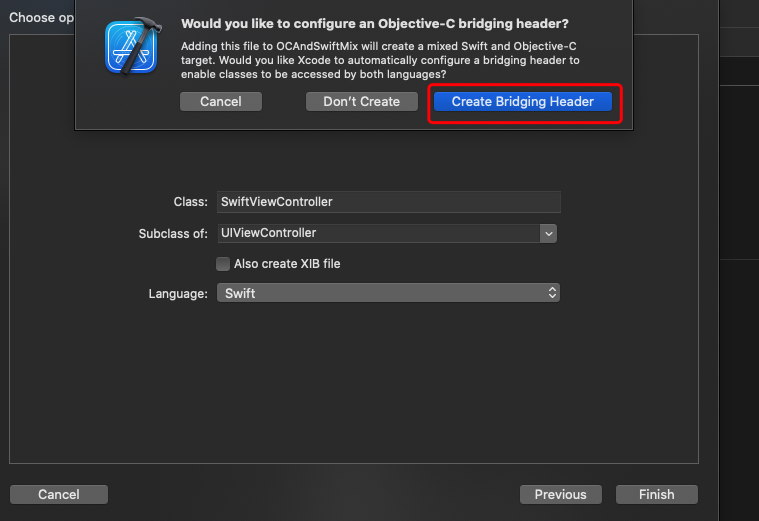
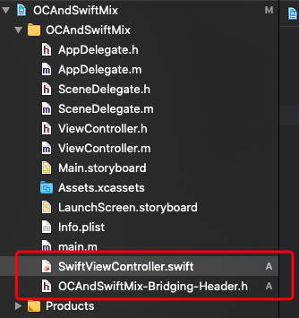
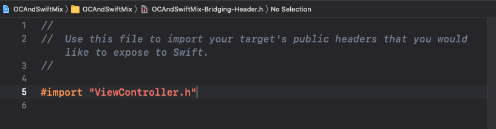
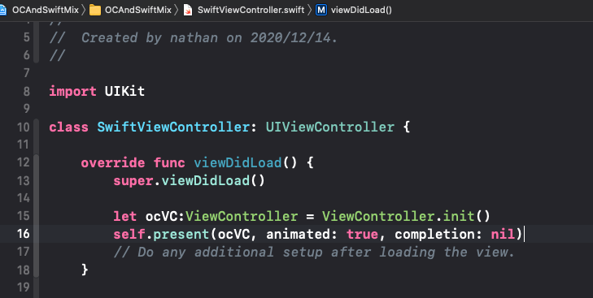
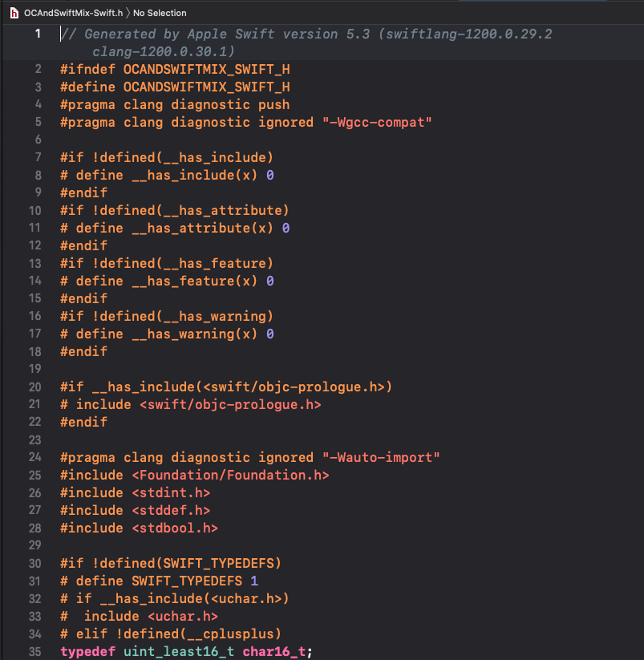
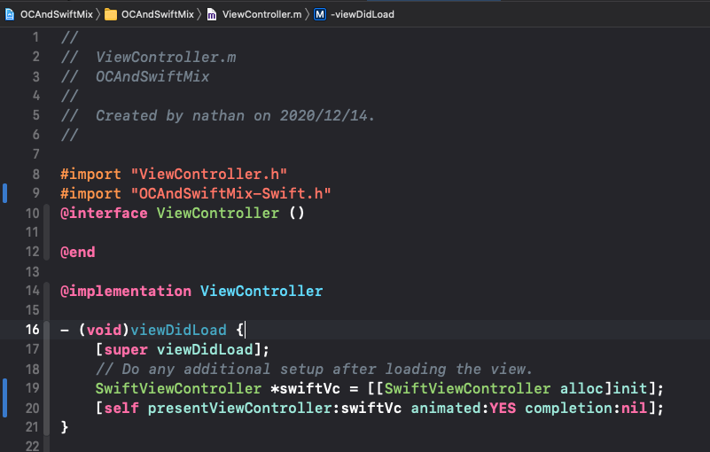
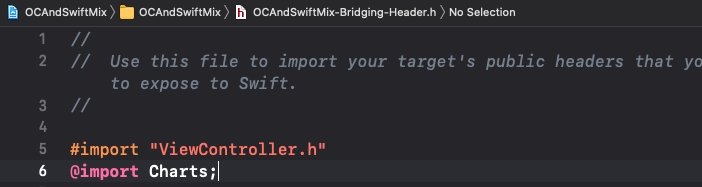
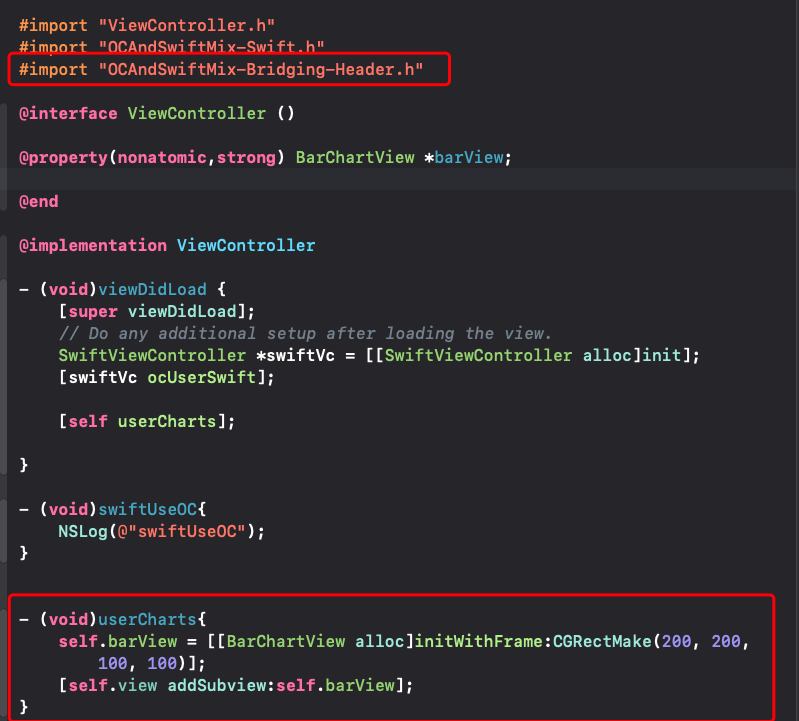

场景：

1. 现有oc项目新增Swift功能模块
2. Swift调用OC
3. OC调用Swift
4. 现有OC项目接入Swift的第三方pod库


[TOC]


# 1、现有oc项目新增Swift功能模块

* 基于OC创建一个OC工程，作为现有OC项目，然后新增Swift功能模块，新建一个Swift文件，Xcode会自动帮你创建一个桥接文件，自己也可以手动创建。

  

  

  

  # 2、Swift调用OC

  如果想在SwiftViewController中调用OC代码，比如调用ViewController,则只需要在OCAndSwiftMix-Bridging-Header.h文件中引入ViewController.h即可。

  

  

  # 3、OC调用Swift

  如果想在ViewController中使用SwiftViewController,则在第一步完成后，直接Build一下项目，会生成一个项目名-Swift.h的文件(OCAndSwiftMix-Swift.h),然后在任意一个文件中引用OCAndSwiftMix-Swift.h文件，如果编译通过或者可以调转到该文件则说明接入成功。

  

  

  使用：

  

# 4、现有OC项目接入Swift的第三方Pod库

* 进入项目根目录，执行pod init 命令，打开podfile文件，进行编辑:

  ```ruby
  # Uncomment the next line to define a global platform for your project
  # platform :ios, '9.0'
  
  target 'OCAndSwiftMix' do
    # Comment the next line if you don't want to use dynamic frameworks
    use_frameworks!
  
    # Pods for OCAndSwiftMix
    pod 'Charts'
  end
  
  ```

  保存后，执行pod install。

  在OCAndSwiftMix-Bridging-Header.h桥接文件中引入Charts:

  

  然后在使用的位置导入桥接文件，就可以正常使用库了：

  

