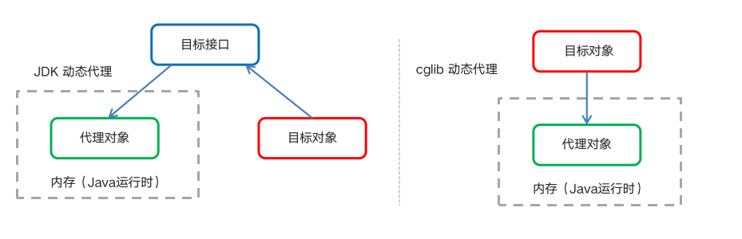
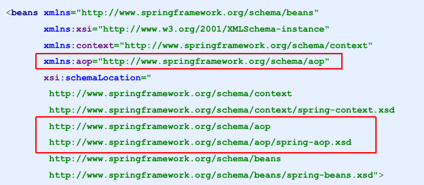

[TOC]


# Spring介绍

##  什么是AOP

​	<font color = "red">AOP</font>为<font color="red">A</font>spect <font color="red">O</font>riented <font color="red">P</font>rogramming的缩写，意思为面向切面编程，是通过预编译方式和运行期动态代理实现程序功能的统一维护的一种技术。

​	AOP是OOP的延续，是软件开发中的一个热点，也是Spring框架中的一个重要内容，是函数式编程的一种衍生范行。利用AOP可以对业务逻辑的各个部分进行隔离，从而使得业务逻辑各个部分之前的耦合度降低，提供程序的可用性，同时提高开发效率。

##  AOP的作用及优势

* 作用：在程序运行期间，在不修改源码的情况下，对方法进行功能增强

* 优势：减少重复代码，提高开发效率，并且便于维护

##  AOP的底层实现

​	AOP的底层是通过Spring提供的动态技术实现的。在运行期间，Spring通过动态代理技术动态生成代理对象，代理对象方法执行时进行增强功能的介入，再去调用目标对象的方法，从而完成功能的增强。

##  AOP的动态代理技术

​	常用的动态代理技术

* JDK代理：基于接口的动态代理技术

* cglib：基于父类的动态代理技术

  

  

##  JDK的动态代理

 1. 目标类接口

    ```java
    public interface TargetInterface {
        public void  save();
    
    }
    ```

 2. 目标类

    ```java
    public class Target implements TargetInterface{
        @Override
        public void save() {
            System.out.println("target save runing");
        }
    }
    ```

 3. 动态代理

    ```java
    //目标对象
    final Target target = new Target();
    //返回值即 动态生成代理对象
    TargetInterface proxy = (TargetInterface) Proxy.newProxyInstance(target.getClass().getClassLoader(), target.getClass().getInterfaces(), new InvocationHandler() {
        @Override
        public Object invoke(Object proxy, Method method, Object[] args) throws Throwable {
            System.out.prinln("前置增强");
            Object invoke = method.invoke(target, args);
            System.out.prinln("后置增强");
            return invoke;
        }
    ```

 4. 调用动态代理对象的方法测试

    ```java
    proxy.save();
    ```

##  cglib的动态代理

1. 目标类

   ```java
   public class Target{
   
       public void save() {
           System.out.println("target save runing");
       }
   }
   ```

2. 动态代理

   ```java
     //目标对象
     final Target target = new Target();
     //返回值即 动态生成代理对象 基于cglib
     //创建增强器
     Enhancer enhancer = new Enhancer();
     //设置父类
     enhancer.setSuperclass(Target.class);
     //设置回调
     enhancer.setCallback(new MethodInterceptor() {
         @Override
         public Object intercept(Object o, Method method, Object[] objects, MethodProxy methodProxy) throws Throwable {
             advice.before();
             Object invoke = method.invoke(target, args);//执行目标
             advice.afterReturning();
             return invoke;
         }
     });
     Target prxoy = (Target) enhancer.create();
   ```

3. 调用动态代理对象的方法测试

   ```java
   proxy.save();
   ```

##  AOP的相关概念

​	Spring的AOP实现底层就是对上面的动态代理的代码进行了封装，封装后我们只需要对需要关注的部分进行代码编写，并通过配置的方式完成指定目标的方法增强。在使用AOP时，需要理解以下常用术语：

* Target（目标对象）：代理的目标对象（即要增强的对象）
* Proxy（代理）：一个类被AOP织入增强后，就会产生一个结果代理类
* Joinpoint（连接点）：所谓连接点是指被拦截到的点，可以理解为正在执行的方法（切入点）。在Spring中这些点只的是方法，因为Spring只支持方法类型的连接点
* Pointcut（切入点）：所谓切入点就是指我们要对哪些Joinpoint进行拦截的定义
* Advise（通知/增强）：就是指拦截到Joinpoint之后所要做的事情，可以理解为增强方法
* Apsect（切面）：切入点和通知的结合
* Weaving（织入）：是指把增强应用到目标对象来创建新的代理对象的过程。spring采用动态织入，而AspectJ采用编译期织入和类装载期织入

##  AOP开发明确的事项

1. AOP实现步骤不知偶

   * 编写目标类和付费
   * 编写切面类，切面可中有增强功能方法
   * 通过动态代理创建代理对象，织入增强方法，即将那些通知与连接点进行结婚

2. AOP技术实现的内容

   Spring框架监控切入点方法的执行，一旦监控到切入点方法被执行，使用代理机制，动态创建目标对象的代理对象，根据通知类别，在代理对象的对应位置，将通知的功能织入，完成完整代码逻辑运行。

3. AOP底层使用哪种代理方式

   在spring中，框架会根据目标类是否实现了接口来决定采用哪种动态代理的方法。

# 基于XML的AOP

##  快速入门

	1. 导入AOP相关坐标
 	2. 创建目标接口和目标类（内有切点）
 	3. 创建切面类（内有增强方法）
 	4. 将目标类和切面类的创建权交给spring
 	5. 在applicationContext.xml中配置织入关系
 	6. 测试代码

* 导入AOP相关坐标

  ```xml
  <dependency>
    <groupId>org.springframework</groupId>
    <artifactId>spring-context</artifactId>
    <version>5.2.9.RELEASE</version>
  </dependency>
  
  <dependency>
    <groupId>org.aspectj</groupId>
    <artifactId>aspectjweaver</artifactId>
    <version>1.8.13</version>
  </dependency>
  ```

* 创建目标接口和目标类（内有切点）

  ```java
  public interface TargetInterface {
      public void  save();
  }
  
  public class Target implements TargetInterface {
  
      @Override
      public void save() {
          System.out.println("target save runing");
      }
  }
  ```

* 创建切面类（内有增强方法）

  ```java
  public class MyAspect {
      public void before(){
          System.out.println("前置代码增强....");
      }
  }
  ```

* 将目标类和切面类的创建权交给spring

  ```xml
  <!--目标对象-->
  <bean id="target" class="com.syyjay.aop.Target"></bean>
  
  <!--切面对象-->
  <bean id="myAspect" class="com.syyjay.aop.MyAspect"></bean>
  ```

* 在applicationContext.xml中配置织入关系

  导入aop命名空间

  

  ​	配置切点表达式和前置增强的织入关系

  ```xml
  <aop:config>
      <!--引用myAspect的Bean为切面对象-->
      <aop:aspect ref="myAspect">
      <!-- 配置Target的save方法执行时要进行myAspect的before方法的前置增强 -->
          <aop:before method="before" pointcut="execution(public void com.syyjay.aop.Target.save())"/>
      </aop:aspect>
  </aop:config>
  ```

* 测试（使用spring）

  ```java
  @RunWith(SpringJUnit4ClassRunner.class)
  @ContextConfiguration("classpath:applicationContext.xml")
  public class AopTest {
      @Autowired
      public TargetInterface target;
  
      @Test
      public void test(){
          target.save();
      }
  }
  ```

##  XML配置AOP

  1. 切点表达式的写法

     语法：

     execution([修饰符] 返回值类型 包名.类名.方法名(参数))

     * 访问修饰符可以省略
     * 返回值类型、包名、类名、方法名可以使用* 代表任意
     * 包名与类名之间一个点. 代表当前包下的任意类，两个点 .. 表示当前包及其子包下的类
     * 参数列表可以用两个点 .. 表示任意个数，任意类型的参数列表

     例如：

     ```xml
     execution(public void com.syyjay.aop.Target.save())
     
     execution(void com.syyjay.aop.Target.*(..)) //任意方法，任意参数
     
     execution(* com.syyjay.aop.*.*(..)) //任意返回值，包下任意类任意方法任意参数
     
     execution(* com.syyjay.aop..*.*(..)) //任意返回值，包下及子包下任意类任意方法任意参数
     
     execution(* *..*.*(..)) //没有限制
     ```

  2. 通知的类型

     通知的配置语法：

     ```xml
     <aop:通知类型 method=“切面类中方法名” pointcut=“切点表达式"></aop:通知类型>
     ```

     <table border ="1"> 
       <th>名称</th><th>标签</th><th>说明</th>
       <tr>
       	<td>前置通知</td>
         <td>&lt;aop:before&gt;</td>
         <td>用于配置前置通知，指定增强的方法在切入点方法执行之前执行</td>
       </tr>
        <tr>
       	<td>后置通知</td>
          <td> &lt;aop:after&gt; </xmp> </td>
         <td>用于配置前置通知，指定增强的方法在切入点方法执行之前执行</td>
       </tr>
     </table>

  3. 切点表达式的抽取


# 基于注解的AOP

## 快速入门

### 基于注解的AOP开发步骤：

* 创建目标接口和目标类
* 创建切面类
* 将目标类和切面类的对象交给Spring
* 在切面类中使用注解配置织入关系
* 在配置文件中开启组件扫描和AOP的自动代理
* 测试注解AOP

#### 创建目标接口和目标类（内部有切点）

```java
public interface TargetInterface {
    public void  save();
}

public class Target implements TargetInterface {

    @Override
    public void save() {
        System.out.println("target save runing");
    }
}
```

#### 创建 切面类（内部有增强方法）

```java

public class MyAspect {)
    public void before(){
        System.out.println("前置代码增强....");
    }
}
```

#### 将目标类和切面类的对象创建权交给Spring

```java
@Component("target")
public class Target implements TargetInterface {

    @Override
    public void save() {
        System.out.println("target save runing");
    }
}

@Component("myAspect")
public class MyAspect {
    public void before(){
        System.out.println("前置代码增强....");
    }
}
```

#### 在切面类中使用注解配置织入关系

```java
@Component("myAspect")
@Aspect
public class MyAspect {
    @Before("execution(public void com.syyjay.anno.Target.save())")
    public void before(){
        System.out.println("前置代码增强....");
    }
}
```

#### 在配置文件中开启组件扫描和AOP自动代理

```xml
<!--组件扫描-->
<context:component-scan base-package="com.syyjay.anno"/>

<!--aop自动代理-->
<aop:aspectj-autoproxy/>
```

#### 功能测试

```java
@RunWith(SpringJUnit4ClassRunner.class)
@ContextConfiguration("classpath:applicationContext-anno.xml")
public class AnnoTest {
    @Autowired
    public TargetInterface target;

    @Test
    public void  test(){
        target.save();
    }
}
```

## 注解配置AOP详情

### 注解通知的类型

通知的配置语法：@通知注解("切点表达式")

<table border="1">
  <tr>
    <th>名称</th><th>注解</th><th>说明</th>
  </tr>
  <tr> 
    <td>前置通知</td> <td>@Before</td> <td>用于配置前置通知，指定增强的方法在切入点方法之前执行</td>
  </tr>
  <tr>
      <td>后置通知</td><td>@AfterReturning</td><td>用于配置后置通知，指定增强的方法在切入点方法之后执行</th>
  </tr>
   <tr>
    <td>环绕通知</td><td>@Around</td><td>用于配置环绕通知，指定增强的方法在切入点方法之前和之之后都执行</tdh>
      </tr>
   <tr>
   <td>异常抛出通知</td><td>@AfterThrowing</td><td>用于配置异常抛出通知，指定增强的方法在出现异常时执行</td>
   </tr>
   <tr>
    <td>最终通知</td><td>@After</td><td>用于配置最终通知，无论增强方式执行是否有异常都会执行</td>
      </tr>
 </table>

### 切点表达式的抽取

和xml配置aop一样，注解同样可以将切点表达式抽取。抽取的方式在切面类中定义，在该方法上使用@Pointcut注解定义切点表达式，然后在增强注解中进行引用。具体如下：

```java
@Component("myAspect")
@Aspect
public class MyAspect {
    @Before("MyAspect.myPoint()")
    public void before(){
        System.out.println("前置代码增强....");
    }

    @Pointcut("execution(public void com.syyjay.anno.Target.save())")
    /*切点表达式抽取*/
    public void myPoint(){}
}
```


