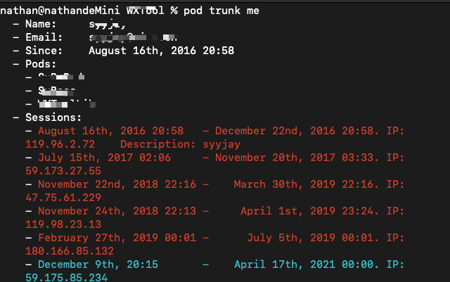
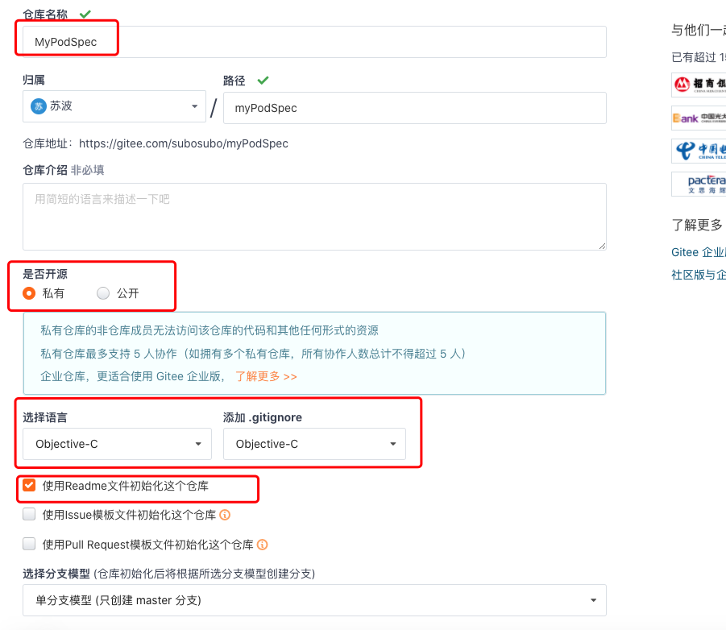
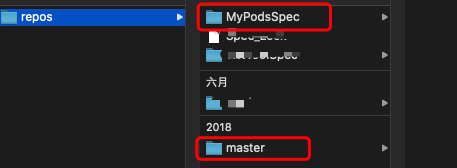
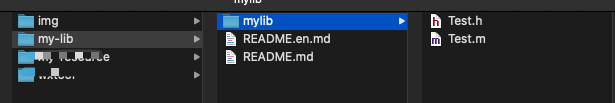
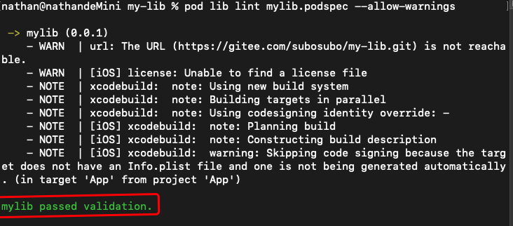
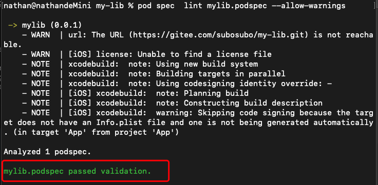
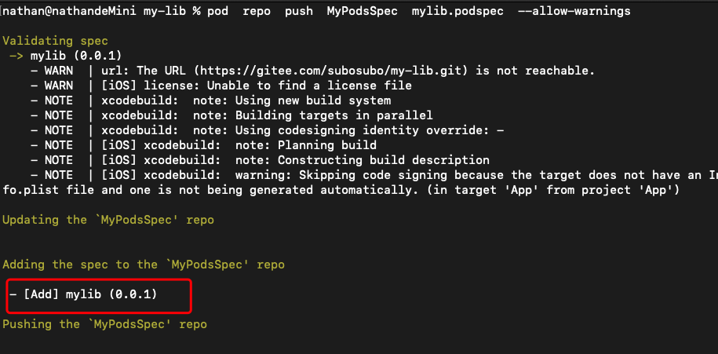
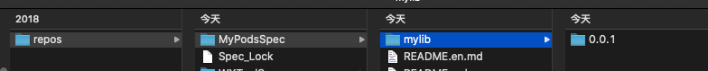
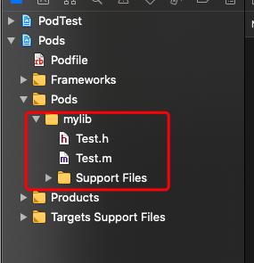
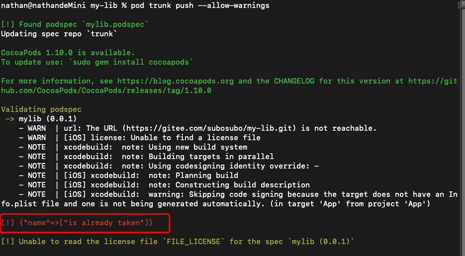

---

title: pods创建远程私有创库

date: 2020-12-12 10:27:57

tags: Object-C

---

# pods创建远程私有创库


 1. 注册：pod  trunk  register  'you email'

 2. 进入邮箱进行验证

 3. 查看是否注册成功

    pod trun me 

4. 创建一个远程仓库，用于存放自己的私有库

5. 在私有库同级目录下，创建spec文件
   
* pod spec create spec-name
  
6. 配置好spec文件，并将私有库提交到git或者gitee

7. 验证spec

    - 验证本地spec

      pod lib lint  spec名称 --allow-warnings

    - 远程验证spec

      远程验证时要给库打tag

      pod spec lint sepc 名称 --allow-warnings
8. 提交spect

    Pod trun push  --allow-warnings

9. 提交成功之后就可以使用私有库了


注意：上面的索引库是使用默认的cocoapods的，如果完全私有化，可以直接在git或者gitee上新建一个spec索引库，步骤如下：
1. 在gitee上新建一个仓库，并添加readme文件
2. 执行以下命令将自己的私有索引库添加到本地repo
    pod repo add spec-name 仓库地址
    添加成功后可以在./cocoapods/repos/目录下看到官方的specs:master和刚刚加入的specs:spec-name
3. cd 进入spec文件所在目录，将索引文件spec加入到刚刚私有索引库中
4. 在podfile文件中，source 指定为私有索引库的仓库地址，就可以正常使用了


# 示例
1.2步骤由于已经配置好，这里省略，直接进入3查看是否注册成功
成功显示如下：



4. 在码云上创建一个spec私有索引库

   

5.将MyPodSpec仓库添加到本地repo

pod repo add  MyPodsSpec  https://gitee.com/subosubo/myPodSpec.git

添加成功后可以在/.cocoapods/repos/目录下可以看到官方的specs:master和刚刚加入的specs:MyPodsSpec



6.通步骤5创建私有库的仓库


然后clone下来，git clone  https://gitee.com/subosubo/my-lib.git,然后添加Test文件，并提交到远程仓库



7. 创建索引文件

   在my-lib目录下创建mylib.spec文件

   pod spec create mylib

   然后编辑mylib.spec 文件

   

   ```ruby
   #
   #  Be sure to run `pod spec lint mylib.podspec' to ensure this is a
   #  valid spec and to remove all comments including this before submitting the spec.
   #
   #  To learn more about Podspec attributes see https://guides.cocoapods.org/syntax/podspec.html
   #  To see working Podspecs in the CocoaPods repo see https://github.com/CocoaPods/Specs/
   #
   
   Pod::Spec.new do |spec|
   
     # ―――  Spec Metadata  ―――――――――――――――――――――――――――――――――――――――――――――――――――――――――― #
     #
     #  These will help people to find your library, and whilst it
     #  can feel like a chore to fill in it's definitely to your advantage. The
     #  summary should be tweet-length, and the description more in depth.
     #
   
     spec.name         = "mylib"
     spec.version      = "0.0.1"
     spec.summary      = "私有库测试"
   
     # This description is used to generate tags and improve search results.
     #   * Think: What does it do? Why did you write it? What is the focus?
     #   * Try to keep it short, snappy and to the point.
     #   * Write the description between the DESC delimiters below.
     #   * Finally, don't worry about the indent, CocoaPods strips it!
     spec.description  = "pods创建私有库的使用"
   
     spec.homepage     = "https://gitee.com/subosubo/my-lib.git"
     # spec.screenshots  = "www.example.com/screenshots_1.gif", "www.example.com/screenshots_2.gif"
   
   
     # ―――  Spec License  ――――――――――――――――――――――――――――――――――――――――――――――――――――――――――― #
     #
     #  Licensing your code is important. See https://choosealicense.com for more info.
     #  CocoaPods will detect a license file if there is a named LICENSE*
     #  Popular ones are 'MIT', 'BSD' and 'Apache License, Version 2.0'.
     #
   
     spec.license      = "MIT (example)"
     # spec.license      = { :type => "MIT", :file => "FILE_LICENSE" }
   
   
     # ――― Author Metadata  ――――――――――――――――――――――――――――――――――――――――――――――――――――――――― #
     #
     #  Specify the authors of the library, with email addresses. Email addresses
     #  of the authors are extracted from the SCM log. E.g. $ git log. CocoaPods also
     #  accepts just a name if you'd rather not provide an email address.
     #
     #  Specify a social_media_url where others can refer to, for example a twitter
     #  profile URL.
     #
   
     spec.author             = { "丁次" => "syyjay@sina.cn" }
     # Or just: spec.author    = "丁次"
     # spec.authors            = { "丁次" => "syyjay@sina.cn" }
     # spec.social_media_url   = "https://twitter.com/丁次"
   
     # ――― Platform Specifics ――――――――――――――――――――――――――――――――――――――――――――――――――――――― #
     #
     #  If this Pod runs only on iOS or OS X, then specify the platform and
     #  the deployment target. You can optionally include the target after the platform.
     #
   
     # spec.platform     = :ios
     # spec.platform     = :ios, "5.0"
   
     #  When using multiple platforms
     # spec.ios.deployment_target = "5.0"
     # spec.osx.deployment_target = "10.7"
     # spec.watchos.deployment_target = "2.0"
     # spec.tvos.deployment_target = "9.0"
   
   
     # ――― Source Location ―――――――――――――――――――――――――――――――――――――――――――――――――――――――――― #
     #
     #  Specify the location from where the source should be retrieved.
     #  Supports git, hg, bzr, svn and HTTP.
     #
   
     spec.source       = { :git => "https://gitee.com/subosubo/my-lib.git", :tag => "#{spec.version}" }
   
   
     # ――― Source Code ―――――――――――――――――――――――――――――――――――――――――――――――――――――――――――――― #
     #
     #  CocoaPods is smart about how it includes source code. For source files
     #  giving a folder will include any swift, h, m, mm, c & cpp files.
     #  For header files it will include any header in the folder.
     #  Not including the public_header_files will make all headers public.
     #
   
     spec.source_files  = "mylib", "mylib/*.{h,m}"
     # spec.exclude_files = "Classes/Exclude"
   
     # spec.public_header_files = "Classes/**/*.h"
   
   
     # ――― Resources ―――――――――――――――――――――――――――――――――――――――――――――――――――――――――――――――― #
     #
     #  A list of resources included with the Pod. These are copied into the
     #  target bundle with a build phase script. Anything else will be cleaned.
     #  You can preserve files from being cleaned, please don't preserve
     #  non-essential files like tests, examples and documentation.
     #
   
     # spec.resource  = "icon.png"
     # spec.resources = "Resources/*.png"
   
     # spec.preserve_paths = "FilesToSave", "MoreFilesToSave"
   
   
     # ――― Project Linking ―――――――――――――――――――――――――――――――――――――――――――――――――――――――――― #
     #
     #  Link your library with frameworks, or libraries. Libraries do not include
     #  the lib prefix of their name.
     #
   
     # spec.framework  = "SomeFramework"
     # spec.frameworks = "SomeFramework", "AnotherFramework"
   
     # spec.library   = "iconv"
     # spec.libraries = "iconv", "xml2"
   
   
     # ――― Project Settings ――――――――――――――――――――――――――――――――――――――――――――――――――――――――― #
     #
     #  If your library depends on compiler flags you can set them in the xcconfig hash
     #  where they will only apply to your library. If you depend on other Podspecs
     #  you can include multiple dependencies to ensure it works.
   
     # spec.requires_arc = true
   
     # spec.xcconfig = { "HEADER_SEARCH_PATHS" => "$(SDKROOT)/usr/include/libxml2" }
     # spec.dependency "JSONKit", "~> 1.4"
   
   end
   
   ```

   然后验证本地podspec文件

   ```ruby
   pod lib lint mylib.podspec --allow-warnings
   ```

   

   代表验证成功了

8. 给远程仓库MyLib打标签，对mylib.podspec进行远程验证

   git tag -a '0.0.1' -m '0.0.1初始化版本'

   git push --tags

   远程验证 mylib.podspec:

   ```ruby
   pod spec  lint mylib.podspec --allow-warnings
   ```

   

   验证成功

9. 将mylib.pods.spec 文件添加到MyPodsSpec索引库中

   ```ruby
   pod  repo  push  MyPodsSpec  mylib.podspec  --allow-warnings
   ```

   添加成功提示如下：

   

   添加成功后可以在/.cocoapods/repos/目录下可以看到MyPodsSpec目录下有了mylib的索引

   

10. 创建工程验证并使用

    新建PodTest工程，并在项目根目录下执行pod init 命令创建Podfile文件，并编辑Podfile文件

    ```ruby
    # Uncomment the next line to define a global platform for your project
    platform :ios, '9.0'
    source 'https://gitee.com/subosubo/myPodSpec.git'
    
    
    target 'PodTest' do
      # Comment the next line if you don't want to use dynamic frameworks
      use_frameworks!
    
      # Pods for PodTest
    
    end
    
    ```

    执行pod install 命令,成功之后打开工程，可以看到我们的私有库以及pod到项目中了

    




11. 如果使用cocoapods官方的Specs:master作为索引库，则不用自己新建一个私有索引库(MyPodsSpec)

    第8步之后，mylib.podspec所在文件的目录下，执行pod trunk push --allow-warnings

    成功即可

    

 这里由于刚刚以及创建了同名的库，因此报name以及存在
